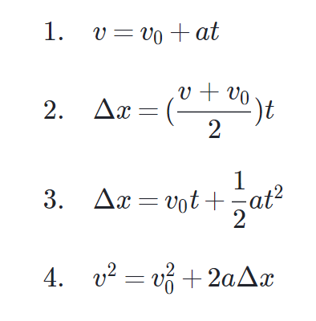

# Movement-Varied-Calculator
Calculadora de Movimiento Rectilíneo Uniforme Variado en Python.


## ⚙️ Estructura
El software solicita al usuario la variable que falta en la ecuación, y después solicita la variable que se desea hallar.

## 🛠️ Fórmulas empleadas
Las fórmulas usadas en el código Python fueron las siguientes:



[Fórmulas de cinemática](https://es.khanacademy.org/science/physics/one-dimensional-motion/kinematic-formulas/a/what-are-the-kinematic-formulas)

## 📦 Deployment
### Windows
La calculadora utiliza Python 3.x
```
python main.py
```
### GNU/Linux

```
python3 main.py
```

## ✒️ Desarrollador
[Marcelo Arias Saavedra](https://360macky.blogspot.com/)
